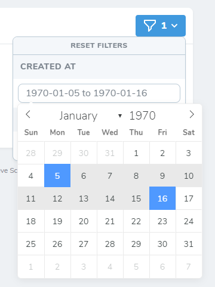
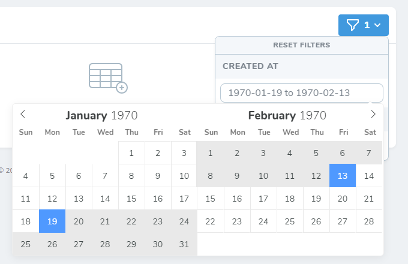

# Laravel Nova Date Range Filter


## About

This is a configurable and ready to use filter for Laravel Nova 2 based on Nova's own date filter that displays a
date range picker.

## Installation

To install the filter run the following command in your Laravel Nova project:

```bash
composer require pos-lifestyle/laravel-nova-date-range-filter
```

## Usage

Simply add this filter to the `filters` method in your Nova resource.

```php
use Illuminate\Http\Request;
use PosLifestyle\DateRangeFilter\DateRangeFilter;

class CustomResource extends Resource
{
    public function filters(Request $request): array
    {
        return [
            new DateRangeFilter(),
        ];
    }
}
```

By default, this will create a filter named "Created at" which applies the selected date range to the `created_at`
database column.

## Customization

The filter takes up to three arguments to customize it to your needs.

<table>
    <tr>
        <td><strong>Parameter</strong></td>
        <td><strong>Type</strong></td>
        <td><strong>Description</strong></td>
        <td><strong>Default</strong></td>
    </tr>
    <tr>
        <td>Name</td>
        <td>String</td>
        <td>The name of the filter how it should appear in the filter dropdown list.</td>
        <td>"Created at"</td>
    </tr>
    <tr>
        <td>Column</td>
        <td>String</td>
        <td>The name of the database column on which the selected date range should be applied to.</td>
        <td>Illuminate\Database\Eloquent\Model::CREATED_AT</td>
    </tr>
    <tr>
        <td>Settings</td>
        <td>Array</td>
        <td>An array of settings to customize the filter. See the configuration section below for details.</td>
        <td>[]</td>
    </tr>
</table>

## Configuration

All available settings are provided by the included `Config` enum. See the full example below how to use it.

<table>
    <tr>
        <td><strong>Setting</strong></td>
        <td><strong>Type</strong></td>
        <td><strong>Description</strong></td>
        <td><strong>Default</strong></td>
    </tr>
    <tr>
        <td>ALLOW_INPUT</td>
        <td>Boolean</td>
        <td>Allows the user to enter a date directly into the input field.</td>
        <td>false</td>
    </tr>
    <tr>
        <td>DATE_FORMAT</td>
        <td>String</td>
        <td>
            A string of characters which are used to define how the date will be displayed in the input box.
            The supported characters are defined in <a href="https://flatpickr.js.org/formatting">this table</a>.
        </td>
        <td>"Y-m-d"</td>
    </tr>
    <tr>
        <td>DEFAULT_DATE</td>
        <td>Array</td>
        <td>
            Sets the initial selected dates.<br><br>
            Supply an array of date strings which follow the format <code>Y-m-d</code>.
        </td>
        <td>null</td>
    </tr>
    <tr>
        <td>DISABLED</td>
        <td>Boolean</td>
        <td>Entirely disables the filter.</td>
        <td>false</td>
    </tr>
    <tr>
        <td>ENABLE_TIME</td>
        <td>Boolean</td>
        <td>Enables the time picker.</td>
        <td>false</td>
    </tr>
    <tr>
        <td>ENABLE_SECONDS</td>
        <td>Boolean</td>
        <td>Enables seconds in the time picker.</td>
        <td>false</td>
    </tr>
    <tr>
        <td>FIRST_DAY_OF_WEEK</td>
        <td>Integer</td>
        <td>
            Sets the first day of the week (0 = Sunday, 1 = Monday etc.).
            If a custom locale is used, this setting has no effect.
        </td>
        <td>0</td>
    </tr>
    <tr>
        <td>LOCALE</td>
        <td>String</td>
        <td>
            Localizes the filter.
            Available locales can be found <a href="https://github.com/flatpickr/flatpickr/tree/master/src/l10n">here</a>.
        </td>
        <td>"default"</td>
    </tr>
    <tr>
        <td>MAX_DATE</td>
        <td>String</td>
        <td>The maximum date that a user can pick to (inclusive).</td>
        <td>null</td>
    </tr>
    <tr>
        <td>MIN_DATE</td>
        <td>String</td>
        <td>The minimum date that a user can start picking from (inclusive).</td>
        <td>null</td>
    </tr>
    <tr>
        <td>PLACEHOLDER</td>
        <td>String</td>
        <td>The text that is shown in the empty input box.</td>
        <td>__('Choose&nbsp;date&nbsp;range')</td>
    </tr>
    <tr>
        <td>SHORTHAND_CURRENT_MONTH</td>
        <td>Boolean</td>
        <td>Shows the month using the shorthand version (e.g. Sep instead of September).</td>
        <td>false</td>
    </tr>
    <tr>
        <td>SHOW_MONTHS</td>
        <td>Integer</td>
        <td>The number of months that should be showed.</td>
        <td>1</td>
    </tr>
    <tr>
        <td>TIME24HR</td>
        <td>Boolean</td>
        <td>Displays the time picker in 24 hour mode without AM/PM selection when enabled.</td>
        <td>false</td>
    </tr>
    <tr>
        <td>WEEK_NUMBERS</td>
        <td>Boolean</td>
        <td>Enables the display of week numbers in the calendar.</td>
        <td>false</td>
    </tr>
</table>

## Full Example

```php
use Illuminate\Http\Request;
use PosLifestyle\DateRangeFilter\DateRangeFilter;
use PosLifestyle\DateRangeFilter\Enums\Config;

class CustomResource extends Resource
{
    public function filters(Request $request): array
    {
        return [
            new DateRangeFilter('Created at', 'created_at', [
                Config::ALLOW_INPUT => false,
                Config::DATE_FORMAT => 'Y-m-d',
                Config::DEFAULT_DATE => ['2019-06-01', '2019-06-30'],
                Config::DISABLED => false,
                Config::ENABLE_TIME => false,
                Config::ENABLE_SECONDS => false,
                Config::FIRST_DAY_OF_WEEK => 0,
                Config::LOCALE => 'default',
                Config::MAX_DATE => '2019-12-31',
                Config::MIN_DATE => '2019-01-01',
                Config::PLACEHOLDER => __('Choose date range'),
                Config::SHORTHAND_CURRENT_MONTH => false,
                Config::SHOW_MONTHS => 1,
                Config::TIME24HR => false,
                Config::WEEK_NUMBERS => false,
            ]),
        ];
    }
}
```

## Screenshots

<table>
    <tr>
        <td><strong>Default configuration</strong></td>
        <td><strong>Showing 2 months</strong></td>
    </tr>
    <tr>
        <td></td>
        <td></td>
    </tr>
</table>
